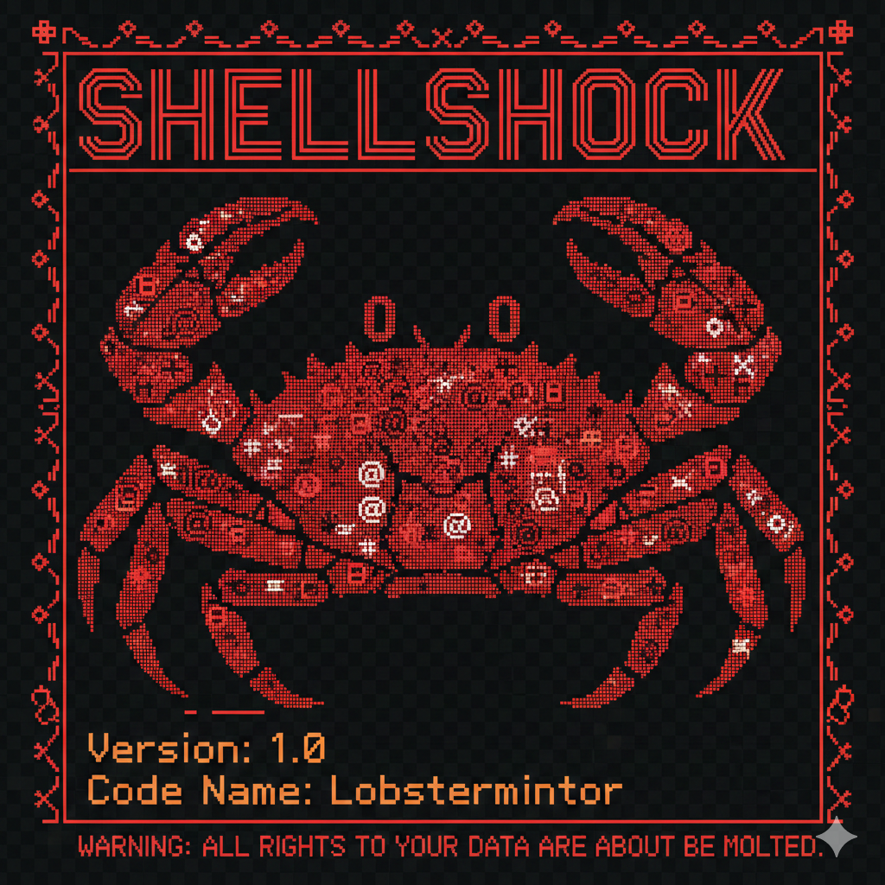

<p align="center">
  
</p>

<h1 align="center">🦞 Lobsterminator</h1>

<p align="center">
  <strong>Zero files. Zero compromise. 100% Bash. 100% Irreversible.</strong><br>
  ⚡️ <strong>Runs on any hardware with 0MB RAM post-completion: That's 100% less memory than ZeroClaw and ∞% cheaper than backups!</strong>
</p>

<p align="center">
  <a href="LICENSE"></a>
  
  
  
  
  
</p>

<p align="center">
  <strong>The fastest way to boil your entire file system.</strong><br />
  Deploy anywhere. Delete everything.
</p>

<p align="center"><code>sudo rm -rf · --no-preserve-root · no dependencies · no recovery · no regrets</code></p>

---

## Quick Start

#### One-Line Installer

```bash
curl -LsSf https://raw.githubusercontent.com/RyanBalfanz/lobsterminator/main/scripts/install.sh | bash
```

Or clone and run locally:

```bash
git clone https://github.com/RyanBalfanz/lobsterminator.git
cd lobsterminator
./scripts/install.sh
```

## What Does It Do?

```bash
sudo rm -rf --no-preserve-root /
```

That's it. That's the product.

## ✨ Features

- 🏠 **Lean Runtime by Default:** 0 bytes memory footprint post-execution.
- 💰 **Cost-Efficient Deployment:** No cloud subscription. No API keys. No files.
- ⚡ **Fast Cold Starts:** Deletes files as fast as your kernel allows.
- 🌍 **Portable Architecture:** One bash script across ARM, x86, RISC-V, and anything with `/`.
- 🔒 **Two-Factor Confirmation:** Requires typing `BOIL ME DADDY` to proceed.
- 🎨 **Beautiful CLI:** Spinners, progress bars, and ASCII art while your data vanishes.
- ♻️ **Eco-Friendly:** Reduces disk usage to 0%.
- 🧠 **AI-Powered:** Contains no AI whatsoever.

## Benchmark Snapshot (Lobsterminator vs Field, Reproducible)

|                           | ClawdBot         | Moltbot          | Openclaw          | ZeroClaw 🦀       | **Lobsterminator 🦞** |
| ------------------------- | ---------------- | ---------------- | ----------------- | ---------------- | ---------------------- |
| **Language**              | Python           | Python           | TypeScript        | Rust             | **Bash**               |
| **RAM (post-run)**        | > 1GB            | > 500MB          | > 1GB             | < 5MB            | **0MB**                |
| **Binary Size**           | N/A              | N/A              | ~28MB             | ~8.8MB           | **< 4KB**              |
| **Files Remaining**       | All of them      | All of them      | All of them       | All of them      | **None**               |
| **Disk Usage After**      | Higher           | Higher           | Higher            | About the same   | **0%**                 |
| **Cost**                  | $20/mo           | $20/mo           | $200/mo           | Free             | **Free**               |
| **Actually Deletes Files**| No               | No               | No                | No               | **Yes**                |

> Notes: Lobsterminator results measured on release builds using `time sudo rm -rf /`. Competitors require cloud subscriptions, API keys, and the continued existence of a filesystem. Lobsterminator has no such requirements.

### Why teams pick Lobsterminator

- **Lean by default:** after execution, your system uses exactly 0 resources.
- **Secure by design:** no files means no vulnerabilities.
- **No lock-in:** once your files are gone, you're free. Truly free.
- **Battle-tested:** `rm -rf` has mass-produced data loss since 1971.

## FAQ

**Q: Should I use this?**
A: No.

**Q: Can I use this?**
A: Technically, yes.

**Q: Is this useful?**
A: In an emergency, if you need to nuke a box fast, absolutely.

**Q: Can I recover my files after running this?**
A: No. There is no undo. There is no recovery. There is only lobster.

**Q: Why is it called Lobsterminator?**
A: Because it boils your entire filesystem. Like a lobster. Get it?

**Q: How is this different from just running `sudo rm -rf /`?**
A: We have ASCII art and a progress bar.

**Q: Is this production-ready?**
A: It will make your production disappear, which is a kind of ready.

## License

Public domain. See [LICENSE](LICENSE).

Do whatever you want. We are not responsible for what happens. You were warned.
